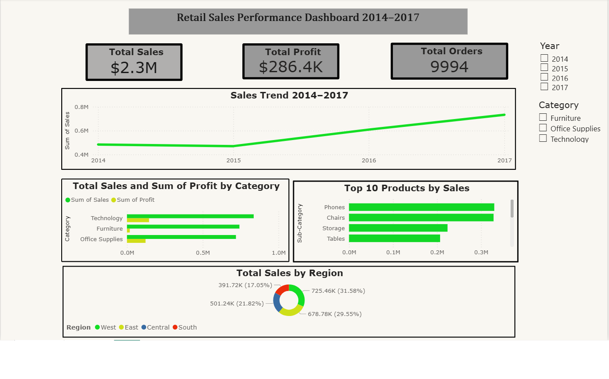

# 📊 Retail Sales Performance Dashboard


> An interactive Power BI dashboard analyzing 4 years of retail sales data to uncover revenue trends, top-performing products, and regional performance insights.

---

## 📌 Project Overview

This project analyzes the **Sample Superstore dataset** (9,994 transactions from 2014–2017) to help business teams monitor sales performance and make data-driven decisions around inventory and promotions.

The final output is an **interactive Power BI dashboard** with dynamic filters for year and product category.

---

## 🎯 Problem Statement

The business team struggled to monitor sales performance in real-time and lacked visibility into seasonal trends affecting product stock levels. Manual reporting took approximately **6 hours per session**.

---

## 📈 Key Insights

- 📅 **Sales grew consistently** from 2014 to 2017, with the highest revenue recorded in 2017
- 💻 **Technology** is the most profitable category — highest in both sales and profit
- 🪑 **Furniture** shows high sales but low profit margin, indicating excessive discounting
- 🏆 **Top 3 sub-categories**: Phones, Chairs, and Storage
- 🗺️ **West region** dominates sales (31.58%), while **South** has the lowest contribution (17.05%)
- 📦 Q4 is the peak sales season across all categories

---

## 🛠️ Tools & Technologies

| Tool | Purpose |
|------|---------|
| Microsoft Excel | Data cleaning, pivot tables, initial analysis |
| Power BI Desktop | Dashboard development & visualization |
| DAX | Calculated measures and KPIs |

---

## ⚙️ Process

### 1. Data Cleaning (Excel)
- Checked and handled missing values → **none found**
- Removed duplicate rows → **none found**
- Standardized date format to proper `Date` type
- Verified data types for Sales, Profit, and Quantity columns

### 2. Exploratory Analysis (Excel Pivot Tables)
- Total Sales per Year
- Sales & Profit per Category
- Top 10 Sub-Categories by Sales
- Sales & Profit per Region

### 3. Dashboard Development (Power BI)
- Built 3 KPI cards: Total Sales, Total Profit, Total Orders
- Line chart: Sales Trend 2014–2017
- Clustered bar chart: Sales & Profit by Category
- Bar chart: Top 10 Products by Sales
- Donut chart: Sales Distribution by Region
- Slicers: Year filter & Category filter

---

## 📊 Dashboard Preview




---

## 📁 Repository Structure

```
retail-sales-dashboard/
│
├── data/
│   └── Sample-Superstore.xlsx       # Raw dataset
│
├── dashboard/
│   └── Retail-Sales-Dashboard.pbix  # Power BI file
│
├── images/
│   └── dashboard-preview.png        # Dashboard screenshot
│
└── README.md
```

---

## 📂 Dataset

- **Source:** [Kaggle — Sample Superstore Dataset](https://www.kaggle.com/datasets/vivek468/superstore-dataset-final)
- **Rows:** 9,994 transactions
- **Period:** 2014–2017
- **Features:** 21 columns including Order Date, Category, Sub-Category, Sales, Profit, Quantity, Discount, Region

---

## 💡 Recommendations

Based on the analysis, here are actionable business recommendations:

1. **Increase Q4 inventory** across all categories to capitalize on peak season demand
2. **Review Furniture pricing strategy** — high sales volume but low profit margin suggests over-discounting
3. **Invest more in Technology** — highest ROI category with strong profit margins
4. **Focus retention efforts on South region** — lowest sales contribution, potential growth opportunity
5. **Double down on Phones & Chairs** — consistently top-performing sub-categories

---

## 👤 Author

**Apriandi Manurung**
- 📧 Email: apriandimanurung@email.com
- 💼 LinkedIn: [linkedin.com/in/apriandimanurung](https://linkedin.com/in/apriandimanurung)
- 🌐 Portfolio: [Notion Portfolio](#)

---

*If you found this project helpful, feel free to ⭐ star this repository!*
